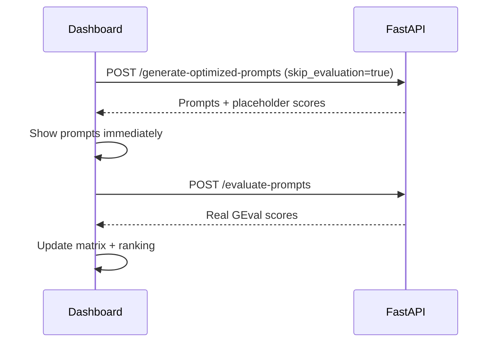

# Concepts

Core ideas behind Lumina Prompt Engine.

## Persona

A **Persona** is the user input that drives prompt generation:

| Field | Meaning | Example |
|-------|---------|---------|
| `identity` | Who the user is | Senior data scientist at a fintech startup |
| `intent` | What they want to achieve | Extract structured insights from customer feedback |
| `output_format` | Desired structure | JSON with keys: sentiment, themes, action_items |

All engines receive the same Persona and produce **model-specific optimized prompts** tuned to each LLM's strengths.

## Two-phase UX

The frontend uses a two-phase flow for responsiveness:

Phase 1 returns prompts fast; Phase 2 runs the DeepEval judge in parallel. CrewAI mode can collapse both phases into one kickoff.

## MONEYSAVER mode

When `money_saver=True`:

- All **six engine cards** keep the same display names (OpenAI GPT-4o, Claude, etc.)
- Every engine call routes through **Groq** (`groq/llama-3.3-70b-versatile`)
- The **judge** also uses Groq (`USE_GROQ_FOR_JUDGE=1`)
- Only **`GROQ_API_KEY`** is required

This lets you demo the full matrix on Groq's free tier without multi-provider billing.

## Evaluation and ranking

Each prompt receives five scores (0.0–1.0) plus reasoning text. **Overall score** is the arithmetic mean of the five criteria. Results sort descending so the champion prompt is obvious.

## Exports

PDF and Excel exports are **client-side only** — they consume the `FinalResponse` JSON already in the browser. No extra API calls.

## Deployment modes

| Mode | Backend | Frontend |
|------|---------|----------|
| **Local dev** | FastAPI on :8000 | Next.js on :3000 |
| **Production** | CrewAI AMP kickoff API | Vercel (from `frontend/`) |

When `NEXT_PUBLIC_CREWAI_BASE_URL` is set, the frontend skips FastAPI and polls CrewAI directly.
